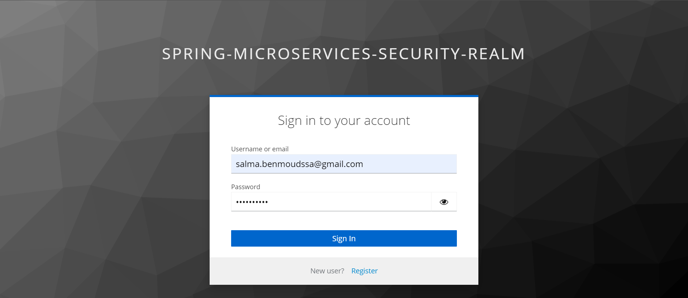
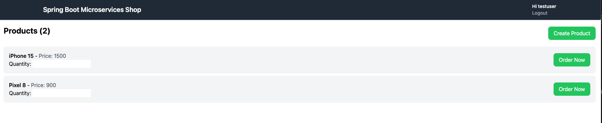
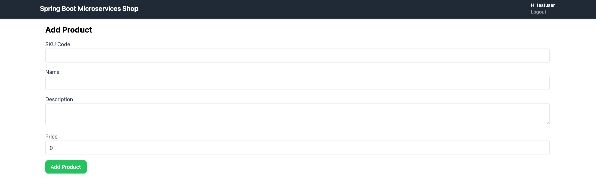
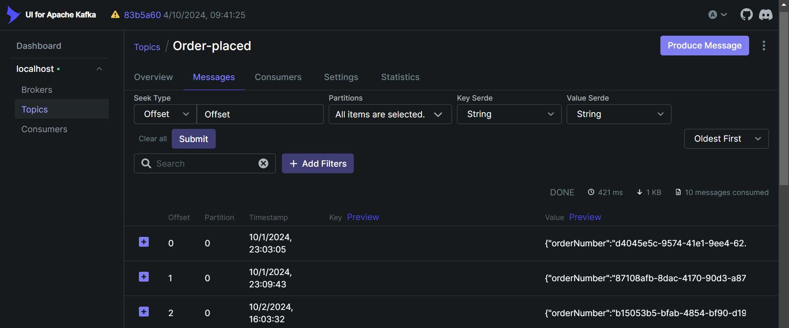
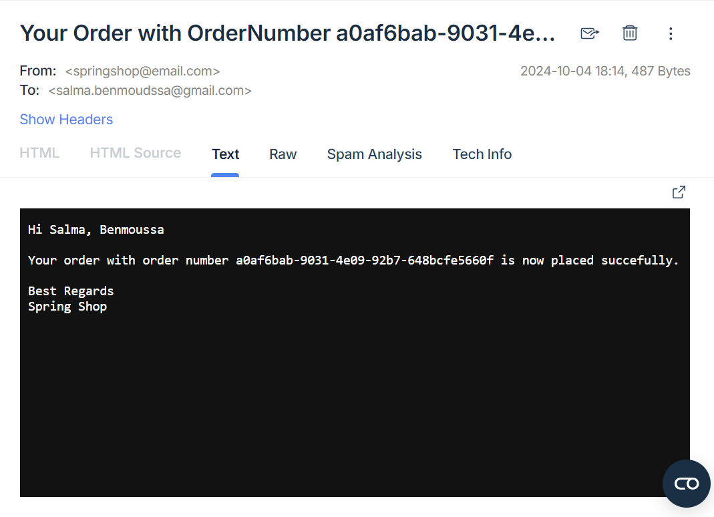
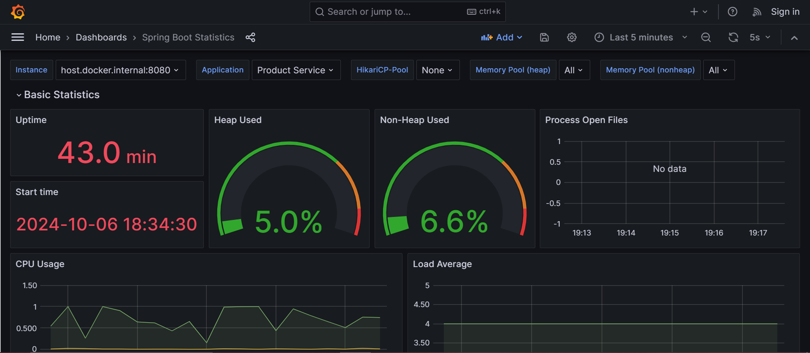

# MicroservicesShopFrontend

This project was generated with [Angular CLI](https://github.com/angular/angular-cli) version 18.0.2.

## Development server

Run `ng serve` for a dev server. Navigate to `http://localhost:4200/`. The application will automatically reload if you change any of the source files.

## Screenshots

Spring Security with Keycloak

Home Page

Add Product page

Storing notifications in Kafka after placing an order

Receive an email in Mailtrap from the notification service using Java MailSender.

Dashboard with Grafana Stack : Grafana-Loki-Tempo

##MicroservicesShopBackend

If you would like to consult the back-end repositories, you can find them here:

https://github.com/salmabenm/API_Gateway.git
https://github.com/salmabenm/Product_Service.git
https://github.com/salmabenm/Order_Service.git
https://github.com/salmabenm/Inventory_Service.git
https://github.com/salmabenm/Notification_Service.git

